# 22.2 Big Data in the Cloud

## Overview

Today's class will continue to build on PySpark DataFrames using Google Colab. The goal today is to demonstrate how natural language processing (NLP) works by creating a big data processing pipeline that is used to train a Naive Bayes spam detector.

## Class Objectives

By the end of today's class, students will be able to:

* Explain why NLP is necessary for a big data tool kit.
* Apply transformations resulting from NLP data processing to PySpark DataFrames.
* Explain and utilize PySpark text-processing methods like tokenization, stop words, n-grams, and term and document frequency.
* Describe example steps in an NLP data processing pipeline.

## Instructor Prep

  
<strong>Instructor Notes
</strong>

* Today's class is a lot of fun! Students are introduced to natural language processing (NLP) and will learn about the bag-of-words model.

* Students should feel comfortable with PySpark DataFrames, which are similar to Pandas DataFrames. However, many NLP concepts will be new to them. The Naive Bayes model in the final activity may also be challenging for some students. It is important to reassure them that this is an advanced model, but it follows the familiar `model, fit, predict` pattern that they have seen previously.

* Today's class introduces the concept of natural language processing in the context of PySpark and PySpark-ML. The lesson builds up to a final activity that illustrates a real-world, big data processing pipeline.

* Please reference our [Student FAQ](../../../05-Instructor-Resources/README.md#unit-22-big-data) for answers to questions frequently asked by students of this program. If you have any recommendations for additional questions, feel free to log an issue or a pull request with your desired additions.

* Lastly, as a reminder these slideshows are for instructor use only - when distributing slides to students, please first export the slides to a PDF file. You may then distribute the PDF file through Slack.

  
<strong>Sample Class Video
</strong>

View an example class lecture here: [Class Video](https://codingbootcamp.hosted.panopto.com/Panopto/Pages/Viewer.aspx?id=e9c85e44-bf16-4c48-ab0b-ab1e0184d1ba&query=22.2%20big%20data). (Note that this video may not reflect the latest lesson plan.)

- - -

# Class Activities

## 1. Welcome & Intro to NLP

| Activity Time:       0:35 |  Elapsed Time:      0:35  |
|---------------------------|---------------------------|

  
<strong> 📣 1.1 Instructor Do: Welcome Class (5 mins)
</strong>

Welcome the class and explain that today's lesson will focus on how to use PySpark to create data pipelines and run natural language processing on a dataset.

  
<strong> 📣 1.2 Instructor Do: Intro to NLP (Slides 1–12) (30 mins)
</strong>

* Today's class will introduce natural language processing through the use of PySpark and PySpark-ML.

* Open the [slideshow](https://drive.google.com/open?id=1toe_YSFfVseia0qDoSK7EN8cqtXjHMjppL5z0DfJbjc) for this lesson and review the goals for today's class. (Slide 2)

* Cover the following points as you review the slides with the class. Be sure to connect NLP with big data by highlighting its potential to organize, classify, and process large amounts of textual data.

  * Natural language processing is a field focused on the goal of having computers interact with (understand and generate) natural (human) language. (Slide 4)

  * Many current technologies use NLP with varying degrees of success.

    * For example, NLP does a decent job of spam filtering, spell-checking, and identifying parts of speech, but it is less accurate when it comes to sentiment analysis and language translation.

    * NLP doesn't yet allow a sustained conversation with a virtual assistant like Siri or Alexa. (Slide 5)

  * NLP holds a lot of potential when applied to big data because of the massive amounts of textual data in almost every industry. NLP can aid in classifying text, extracting information, and summarizing documents. (Slides 6–7)

  * The intricacies of language pose immense challenges for NLP. (Slides 8–9)

  * To make textual information readable to a computer, several steps are often used in a pipeline in which each level builds on the last. (Slide 10)

  * After sentence segmentation, a typical next step in an NLP pipeline is tokenization.

    * Tokenization can be low level, splitting words or sentences, or high level, determining if two or more words should be grouped together.

    * In the next example, we will use PySpark to achieve low-level tokenization of sentences. (Slide 10)

  * Tokenization segments the text into a group of characters that have meaning. The text is separated into tokens, which is similar to the  `.split()` method in Python. (Slides 11–12)

* Stop before getting to the Stop Words Removal slide. You will pick the slideshow back up after the following activities on tokenization.

## 2. PySpark NLP Tokens

| Activity Time:       0:30 |  Elapsed Time:      1:05  |
|---------------------------|---------------------------|

  
<strong> 📣 2.1 Instructor Do: PySpark NLP Tokens (5 mins)
</strong>

* Import [nlp_tokens.ipynb](Activities/01-Ins_Pyspark_NLP_Tokens/Solved/nlp_tokens.ipynb) into Colab and run the code.

* Go over the code and be sure to explain the following:

  * Tokenizing, as described by the PySpark documentation, is "the process of taking the text (such as a sentence) and breaking it into individual terms (usually words)."

  * Tokenizing is a method that comes with the PySpark library.

  * A sample DataFrame is created, and the words are tokenized using the  `Tokenizer` function.

  * Using the `transform` method from the tokenizer, turn the DataFrame into a tokenized dataset.

    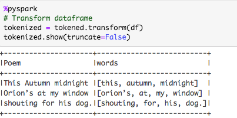

  * A new column is added, with each row tokenized into a list of words.

  * The `show()` method uses `truncated=False` to make sure the whole column is shown.

* Answer any remaining questions before moving on.

  
<strong> 📣 2.2 Instructor Do: User-Defined Functions (5 mins)
</strong>

* Import [udf.ipynb](Activities/02-Ins_UDF/Solved/udf.ipynb) into Colab and run the code.

* Explain that Spark uses user-defined functions (UDFs), which allow Python functions to be passed into SQL. Here, the created function will return the length of each list passed.

* Explain that user-defined functions can be used to add custom output columns. Here, the output is enhanced by returning a token count for each line. Word count can be used as a data point in NLP.

  * Create a DataFrame and the tokenizer function.

    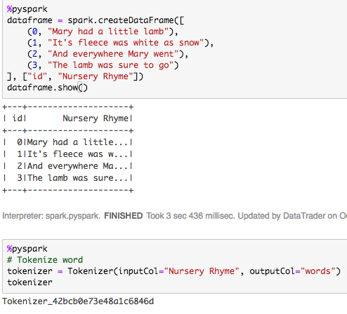

  * Create a function that will return the length of a list, and use it to create a user-defined function that returns an integer.

    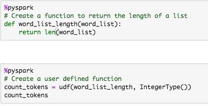

  * The UDF that was defined earlier is passed on the word list in the Words column to form a new column, Tokens.

    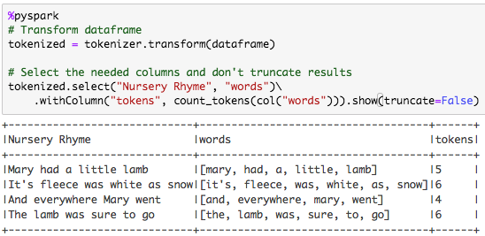

  
<strong> ✏️ 2.3 Student Do: PySpark NLP Tokens (15 mins)
</strong>

* In this activity, students will create NLP tokens using PySpark.

* **Files:**
  * [tokenizing_data.ipynb](Activities/03-Stu_Pyspark_NLP_Tokens/Unsolved/tokenizing_data.ipynb)

  * [data.csv](Activities/03-Stu_Pyspark_NLP_Tokens/Resources/data.csv)

* **Instructions:** [README.md](Activities/03-Stu_Pyspark_NLP_Tokens/README.md)

  
<strong> ⭐ 2.4 Review: PySpark NLP Tokens (5 mins) 
</strong>

* Import [tokenizing_data.ipynb](Activities/03-Stu_Pyspark_NLP_Tokens/Solved/tokenizing_data.ipynb) in Colab.

* Go over the code and review the following steps.

  * Import dependencies and read in the CSV file.

  * Store the result in a PySpark DataFrame.

  * Use `.option("header", "true")` to keep the header.

    

  * Tokenize the DataFrame, taking the Poem column as input and sending to the Words column as output.

  * Create a function that will determine the number of vowels in a sentence using standard Python.

  * Store the function as a user-defined function that will return an integer.

    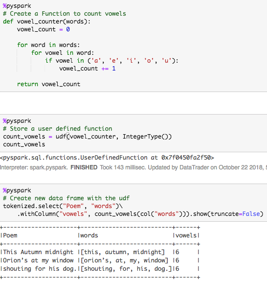

  * Create a new DataFrame that will run the UDF on the tokenized column, which will then display a new column with the results of the UDF.

    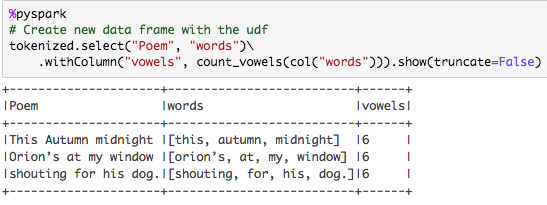

[Having issues with this activity? Report a bug!](https://bit.ly/34t4yWE)

## 3. Food Review Stop Words

| Activity Time:       0:20 |  Elapsed Time:      1:25  |
|---------------------------|---------------------------|

  
<strong> 📣 3.1 Instructor Do: PySpark NLP Stop Words (Slides 13–15) (5 mins)
</strong>

* Use the slides to cover the following points:

  * Stop words are words that have little or no linguistic value in natural language processing. (Slide 14)

  * Removing stop words from the data can improve the accuracy of the language model because it removes words that aren't important to the text.

  * While there are common stop words such as `a`, `and`, `the`, etc., any word can be considered a stop word if it does not contribute to the meaning of the sentence.

  * Stop word removal is a very common step in the NLP pipeline, especially for information retrieval, as stop words don't distinguish between relevant and irrelevant content.

  * Stop words can be filtered out after the text is tokenized into words. (Slide 15)

* Import [nlp_stopwords.ipynb](Activities/04-Ins_Pyspark_NLP_Stopwords/Solved/nlp_stopwords.ipynb) into Colab and walk through the code. Cover the following points:

  * `StopWordsRemover` works like `Tokenizer` in that it takes an input column and returns an output column, but with stop words removed.

  * We are passing `StopWordsRemover` text that has already been tokenized. The stop words are filtered out of the tokenized text.

    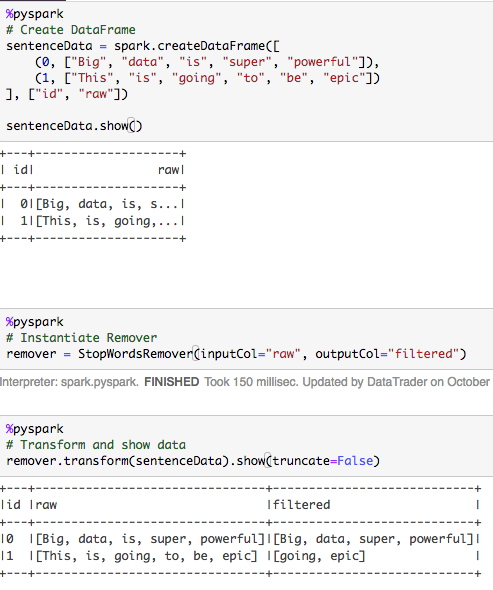

* Answer any questions before moving on.

  
<strong> ✏️ 3.2 Student Do: Food Review Stop Words (10 mins)
</strong>

* In this activity, students will remove stop words from a food review dataset using PySpark.

* **Files:**

  * [nlp_stopwords.ipynb](Activities/05-Stu_Pyspark_NLP_Stopwords/Unsolved/nlp_stopwords.ipynb)

  * [food_reviews.csv](Activities/05-Stu_Pyspark_NLP_Stopwords/Resources/food_reviews.csv)

* **Instructions:** [README.md](Activities/05-Stu_Pyspark_NLP_Stopwords/README.md)

  
<strong> ⭐ 3.3 Review: Food Review Stop Words (5 mins) 
</strong>

* Import [nlp_stopwords.ipynb](Activities/05-Stu_Pyspark_NLP_Stopwords/Solved/nlp_stopwords.ipynb) into Colab.

* Go over the code, reviewing the following steps:

  * Use `Tokenizer` to tokenize the DataFrame from the Reviews column into the Words column.

  * The `transform` function is used to generate new DataFrames at each stage of the processing pipeline.

    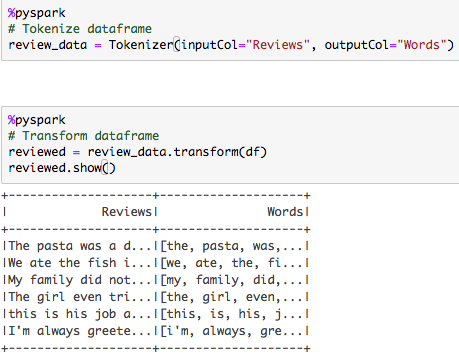

  * Use `StopWordsRemover` to remove the stop words from the Words column and store them in the Filtered column.

  * Repeat the transform step with the new DataFrame.

  * Use `select` and `truncate=False` to show the Filtered column.

    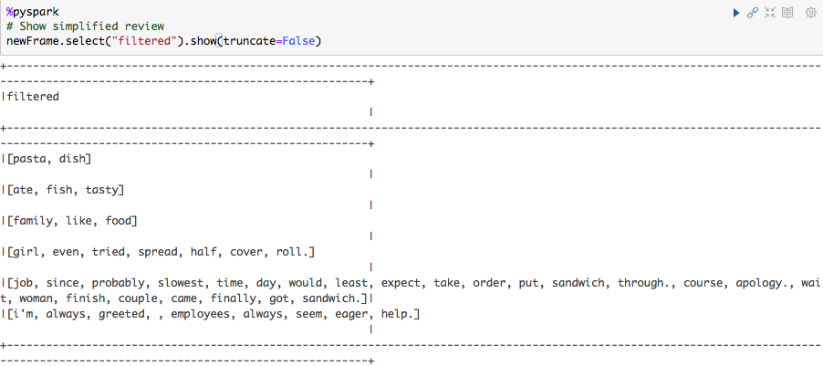

* If students would like more review, slack out [documentation](https://spark.apache.org/docs/2.1.0/ml-features.html) that provides a more detailed overview of use cases and examples.

[Having issues with this activity? Report a bug!](http://bit.ly/2XSUvH6)

## 4. PySpark NLP TF–IDF with HashingTF

| Activity Time:       0:35 |  Elapsed Time:      2:00  |
|---------------------------|---------------------------|

  
<strong> 📣 4.1 Instructor Do: PySpark NLP TF–IDF with HashingTF (Slides 16–21) (15 mins)
</strong>

* Review the slides on term frequency-inverse document frequency (TF–IDF) and the methods used in TF–IDF, HashingTF, and IDFModel.

  * TF–IDF stands for term frequency-inverse document frequency, a vectorization method for showing how important a word is in a text. (Slide 17)

  * Term frequency (TF): The value of a word increases based on how often it appears in a document. (Slide 17)

  * Inverse document frequency (IDF) is a measure of how significant a word is with respect to the entire corpus (all of the words).

  * A high TF–IDF is significant because it reflects high frequency in the current document but not elsewhere. (Slide 17)

  * The functions that calculate term frequency use a "bag of words" approach in which grammar and order are disregarded, but multiplicity is kept. (Slide 18)

  * TF can be calculated in PySpark using `CountVectorizer` or `HashingTF`.

    * `CountVectorizer` indexes the words across all documents and returns a vector of word counts corresponding to the indexes. The indexes are assigned in descending order of frequency. For example, the word with the highest frequency across all documents will be given an index of 0, while the word with the lowest frequency will have an index equal to the number of words in the corpus. (Slide 19)

    * `HashingTF` converts words to numeric IDs. The same words are assigned the same IDs. Those IDs are then mapped to an index and counted, and a vector is returned. `HashingTF`  will be used in class today. (Slide 20)

  * The IDFModel scales each column based on feature vectors, which decrease weights on words found in multiple documents. (Slide 21)

  * If students want more reference material, slack out the following links:

    * [What does tf-idf mean?](http://www.tfidf.com/)

    * [The TD*IDF Algorithm Explained](https://www.elephate.com/blog/what-is-tf-idf/)

    * [TF-IDF Weighting](https://nlp.stanford.edu/IR-book/html/htmledition/tf-idf-weighting-1.html)

* Import [nlp_hashingTF.ipynb](Activities/06-Ins_Pyspark_NLP_HashingTF/Solved/nlp_hashingTF.ipynb) into Colab.

* Go through the code with students, reviewing the following steps:

  * Tokenize the DataFrame.

  * Use `HashingTF` to hash terms into fixed-length vectors, map to an index, and return a vector of term counts.

    * Note that `HashingTF` takes a `numFeatures` parameter, which specifies the number of buckets into which the words will be split. This number must be higher than the number of unique words.

    * By default, this value is `2^18`, or `262,144`.  A power of 2 should be used so that indexes are evenly mapped.

  * Transform the DataFrame to include feature information from `HashingTF`.

    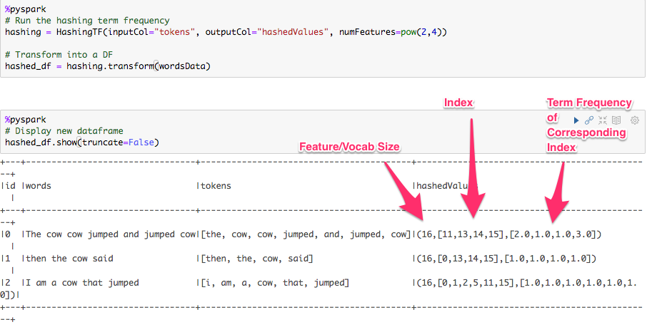

  * Create and fit an IDFModel, which will scale the values while down-weighting based on document frequency. A TF–IDF measure is the result.

    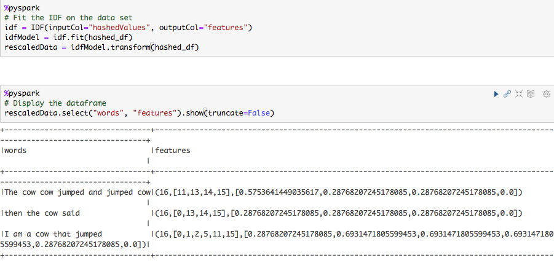

  
<strong> ✏️ 4.2 Student Do: PySpark NLP TD–IDF with HashingTF (10 mins)
</strong>

* In this activity, students will apply what they have learned so far to hash values from an airline dataset using PySpark.

* **Files**

  * [airline_hashing.ipynb](Activities/07-Stu_Pyspark_NLP_HashingTF/Unsolved/airline_hashing.ipynb)

  * [airlines.csv](Activities/07-Stu_Pyspark_NLP_HashingTF/Resources/airlines.csv)

* **Instructions:** [README.md](Activities/07-Stu_Pyspark_NLP_HashingTF/README.md)

  
<strong> ⭐ 4.3 Review: PySpark NLP TD–IDF with HashingTF (5 mins)
</strong>

* Open [airline_hashing.ipynb](Activities/07-Stu_Pyspark_NLP_HashingTF/Solved/airline_hashing.ipynb).

* Go through the code, reviewing the following steps:

  * Load the CSV and tokenize the DataFrame.

  * Run `StopWordsRemover` on the tokenized DataFrame.

    * For the bonus, a list of additional words can be created and passed in as the third argument.

      

  * Hash the term frequencies, keeping the number of features to the power of 2.

  * Fit the data to the IDFModel.

    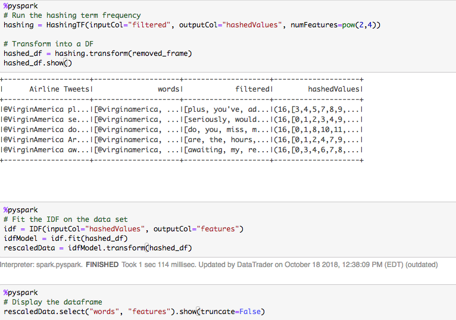

  
<strong> 📣 4.4 Instructor Do: Review Class Objectives (Slide 23) (5 mins)
</strong>

* Take a moment to review the class objectives that have been achieved up to this point. (Slide 23)

[Having issues with this activity? Report a bug!](https://bit.ly/2XkRMrq)

- - -

## Break
| Activity Time:       0:15 |  Elapsed Time:      2:15  |
|---------------------------|---------------------------|

- - -

## 5. Yelp Reviews

| Activity Time:       0:45 |  Elapsed Time:      3:00  |
|---------------------------|---------------------------|

  
<strong> 👥 5.2 Everyone Do: Classifying Yelp Reviews (40 mins)
</strong>

* This activity uses a Naive Bayes classifier and NLP data processing pipeline to classify reviews from Yelp as either positive or negative.

* Explain that PySpark-ML uses the same `model->fit->predict` pattern that Scikit-learn uses for creating and training machine learning models. Naive Bayes is just a new machine learning model that can be used to classify text.

* **Files:**

  * [naive_review.ipynb](Activities/08-Evr_Naive_Bayes_Reviews/Unsolved/naive_review.ipynb)

  * [yelp_reviews.csv](Activities/08-Evr_Naive_Bayes_Reviews/Resources/yelp_reviews.csv)

* Walk through the following steps with the class:

  * Read in the file containing Yelp reviews.

  * Create a column that adds the length of the review as a feature.

    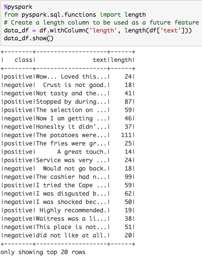

  * Create a list of transformations to be applied in the pipeline.

    

  * Create a feature vector containing the output from the IDFModel (the last stage in the pipeline) and the length.

    

  * Set up the pipeline and fit it to the data.

    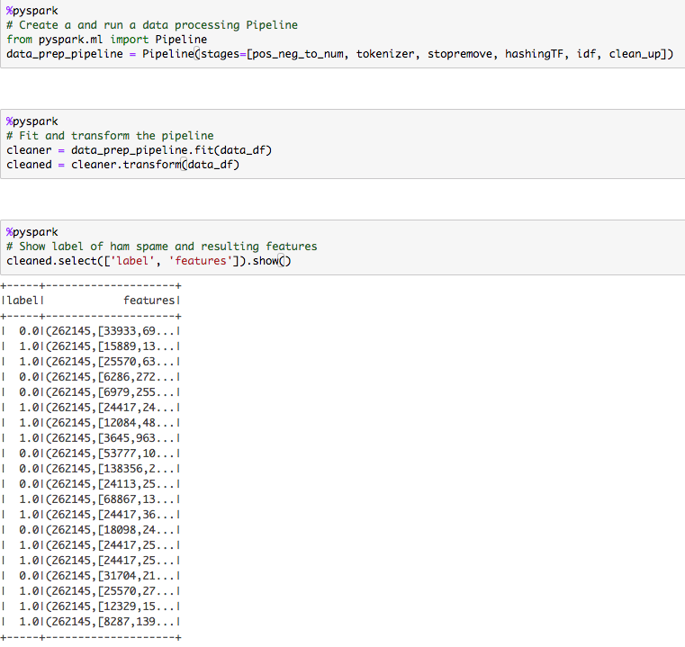

  * Create training and testing data.

  * Create and fit the Naive Bayes model to the training data.

  * Predict outcomes using the testing set.

  * Use `MulticlassClassificationEvaluator` to evaluate the model on the testing set.

    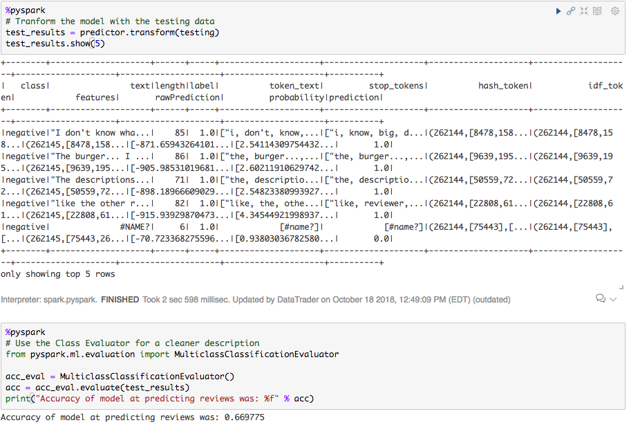

  
<strong> 📣 Instructor Do: Review Class Objectives (Slides 24–25) (5 mins)
</strong>

Take a moment to review the class objectives that have been achieved up to this point. (Slide 25)

[Having issues with this activity? Report a bug!](https://bit.ly/2RncvqX)

- - -

## End Class

- - -

## Copyright

© 2019 Trilogy Education Services
